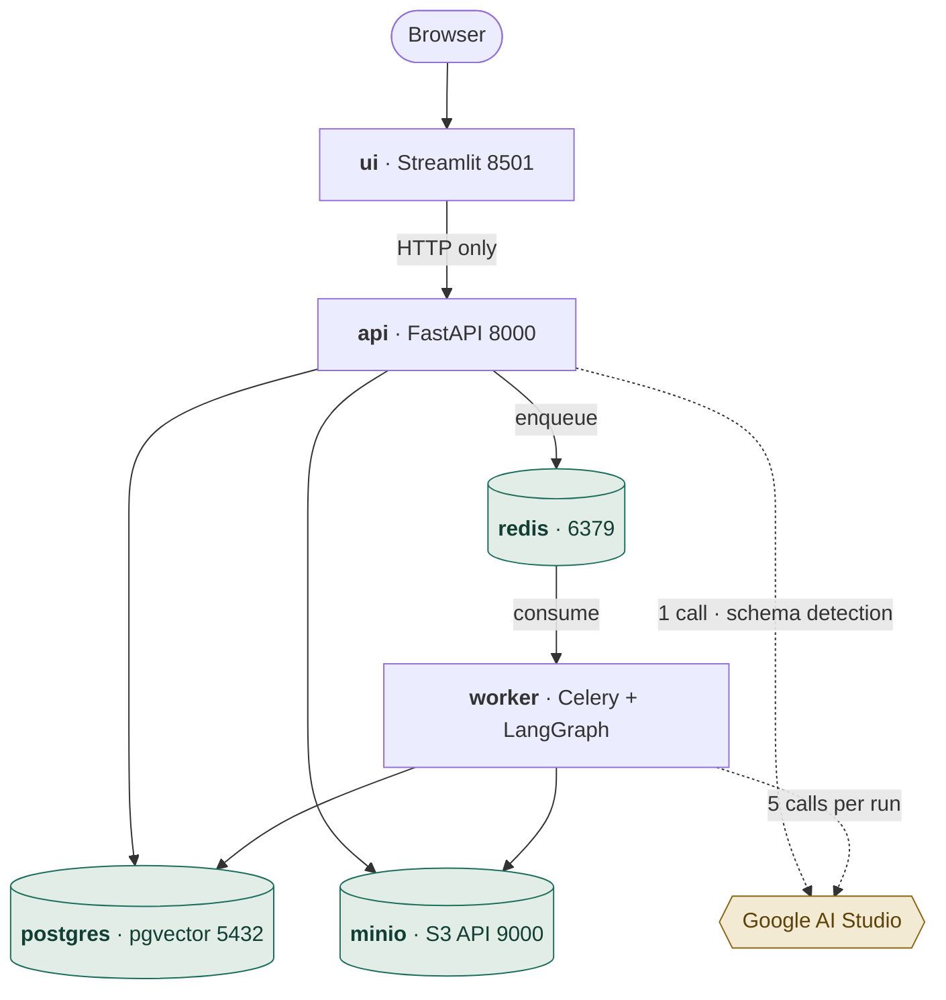
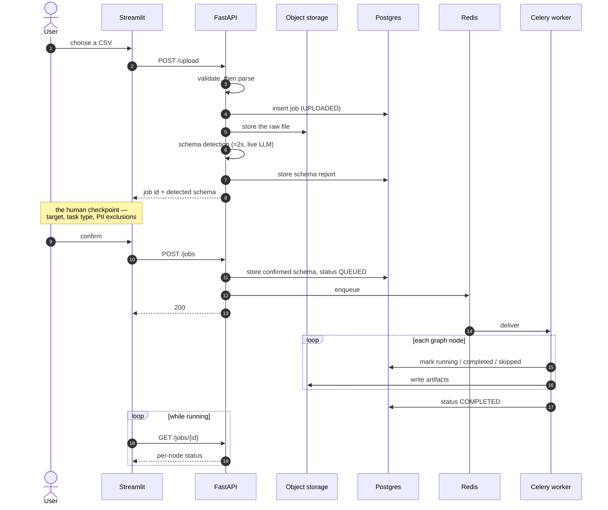
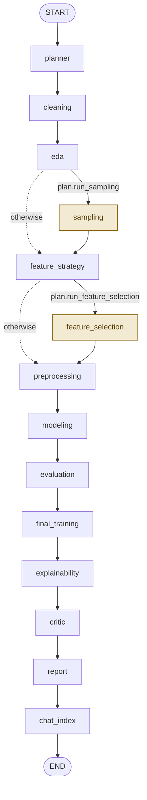
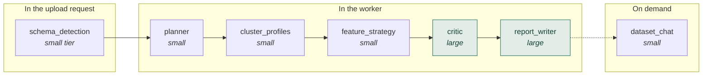
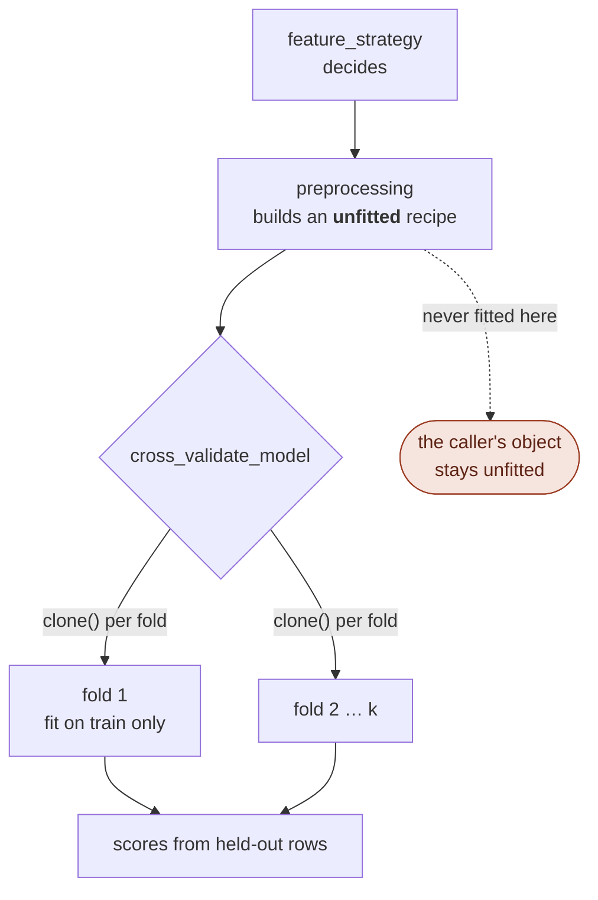

# Architecture

Every diagram here was generated from the running system rather than drawn from
the spec — the pipeline graph from `PIPELINE_NODES` and `OPTIONAL_NODES`, the
tables from `information_schema`, the endpoints from the live OpenAPI document.
Where the spec and the code disagree, this describes the code.

- [The containers](#the-containers)
- [The request path](#the-request-path)
- [The pipeline graph](#the-pipeline-graph)
- [Who calls the model, and when](#who-calls-the-model-and-when)
- [Where the leakage guarantee lives](#where-the-leakage-guarantee-lives)

Related: [data model](data-model.md) · [API reference](api.md) · [runbook](RUNBOOK.md)

---

## The containers

Six services, all started by one `docker compose up`.

The UI never touches the database or object storage: it is an HTTP client of the
API and nothing else. That is what makes the API the only thing that has to be
deployed for a programmatic user, and it is why the Streamlit layer can be
replaced without touching anything below it.

**Storage is an abstraction, not MinIO.** `app/core/storage.py` speaks the S3 API,
and `S3_ENDPOINT_URL` is the only thing pointing it at the local container. Unset
that variable on AWS and the same code talks to real S3 through the instance's IAM
role — which is what "cloud-ready by construction" actually cashes out to.

**The vector store is the database.** The spec locks ChromaDB and documents
pgvector as the sanctioned fallback; this takes the fallback, so embeddings live
in `run_chunks` alongside everything else. One less container, and on AWS one less
persistent volume.

---

## The request path

The human checkpoint is the load-bearing part of this diagram. Schema detection
runs **synchronously inside the upload request**, so the user confirms between two
jobs rather than mid-run — no workflow pause-and-resume machinery is needed, and
no running graph is ever suspended.

Confirming *is* launching: `POST /jobs` writes `QUEUED` and dispatches in the same
request. The status is committed before the dispatch, so a worker that picks the
job up instantly cannot have its `RUNNING` clobbered back to `QUEUED` by the tail
of the request that created it.

---

## The pipeline graph

Fourteen nodes. Twelve always run; two are conditional, and a node routed past is
recorded as **skipped with a reason** rather than left looking unreached.

The graph is **built by walking `PIPELINE_NODES`**, not by wiring edges by hand.
That list is also what the Progress page renders, so the roadmap the user watches
and the graph the worker executes cannot drift apart — they are the same object.
The builder raises if two optional nodes are ever made adjacent, because the
router can only skip one at a time and the failure would otherwise be a silently
unreachable node.

| Node | Always runs | What it produces |
|---|---|---|
| `planner` | ✅ | The plan the conditional edges read |
| `cleaning` | ✅ | Duplicate and unusable-row removal, dropped-column report |
| `eda` | ✅ | Statistics, six charts, clustering with LLM group profiles |
| `sampling` | conditional | A stratified subset, when the planner asks for one |
| `feature_strategy` | ✅ | The LLM's per-column preparation decisions |
| `feature_selection` | conditional | *How many* features to keep — the selector itself is a pipeline step |
| `preprocessing` | ✅ | An **unfitted** scikit-learn recipe |
| `modeling` | ✅ | Four candidates scored on identical folds |
| `evaluation` | ✅ | Cross-validated metrics and per-fold detail |
| `final_training` | ✅ | The one full-data fit, which is the served model |
| `explainability` | ✅ | SHAP in the user's own column names |
| `critic` | ✅ | Measured checks first, then the model's commentary |
| `report` | ✅ | Markdown, and a best-effort PDF |
| `chat_index` | ✅ | Passages embedded into `run_chunks` |

**Why `eda` sits where it does.** After cleaning, so the charts describe the data
the model actually saw; before preprocessing, because it is purely descriptive.
Nothing downstream reads its output, which is exactly what lets it fail without
taking the model with it.

**Why `sampling` sits after `eda`.** So the charts always describe every uploaded
row and only the modelling sees a subset.

**Why `feature_strategy` and `preprocessing` are two nodes.** One decides, the
other builds. Splitting them means the LLM's choice lands as its own step on the
Progress page, and means a strategy artifact exists to read even if building the
recipe from it later fails.

---

## Who calls the model, and when

Seven agents exist; **six calls happen in a normal run**, and the seventh is the
chat, which runs on demand afterwards. Measured identically across all three live
runs.

**Every one of them degrades to a deterministic fallback.** With no API key the
pipeline still completes: detection profiles the file without semantic meanings,
the planner takes defaults, feature strategy uses dtype rules, and the critic
still reports everything it measured rather than judged. This is why the test
suite runs offline and why a rate limit does not fail a run.

**The two large-tier agents are ~75% of the wall clock.** On the churn dataset,
21.0s and 27.6s of 63.5s. Everything deterministic is sub-second. The one
exception is EDA, whose cost scales with the data rather than the prose — 113s of
a 250s run at 100,000 rows.

**Rate limits step down rather than fail.** Hitting the free tier's large-tier
limit mid-run logs `Rate limited on the large tier; stepping down` and completes
on the small model, with shorter and plainer prose. Verified under a full
pipeline, not only in a unit test.

---

## Where the leakage guarantee lives

This is the claim the project is built on, so it is worth saying exactly which
code enforces it.

`build_preprocessor` returns something that has never seen data. `cross_validate_model`
clones it per fold and fits each clone on training rows only. SMOTE is a step
inside an `imblearn` pipeline, so it is applied during `fit` and skipped during
`predict` — each fold trains balanced and is scored on the real skew.

`final_training` is the one place a full-dataset fit is correct, because that
model is the one served. No score is recomputed there: the figure in the artifact
is the cross-validated one, named `cv_score`, since a model fitted on every row
has no unseen data left to be measured against.

**The assertions were checked by breaking them** (30 July 2026). Three leaks were
introduced into `cross_validate_model` and reverted; all three were caught. The
useful result: dropping the `clone` is *not* caught by the row-counting spy —
every fold still refits on 80 training rows, so the log looks perfect — and is
caught only by the two other proofs. The overlap between them is load-bearing.
See the docstring in `tests/test_leakage.py`.
