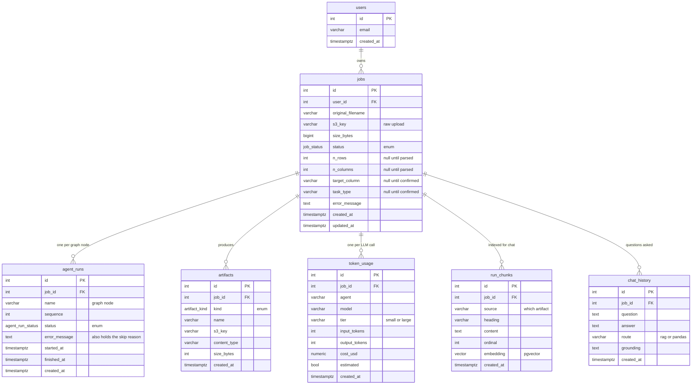

# Data model

Seven tables. Generated from `information_schema` on a live database rather than
from the models, so this is what actually exists after `make migrate`.

Related: [architecture](architecture.md) · [API reference](api.md)

---



Every child table cascades from `jobs`, so deleting a job removes its runs,
artifacts, usage, embeddings and conversation with it.

---

## What each table is for

**`jobs`** is the spine. Its `status` is the job lifecycle — `uploaded` →
`confirmed`/`queued` → `running` → `completed` or `failed`. `target_column` and
`task_type` are null until the human checkpoint, which is what distinguishes an
uploaded file from a job that is allowed to run.

**`agent_runs`** is one row per graph node, created up front so the Progress page
can show the whole roadmap immediately rather than growing it as work completes.
`(job_id, name)` is unique. Note that `error_message` carries **two** kinds of
text: why a node failed, and why a node was skipped — the `status` beside it is
what says which, and a skipped node's reason is a feature rather than an error.

**`artifacts`** is a registry, not a store. The bytes live in object storage and
this table records where, how big, and what content type — so listing a job's
outputs never touches S3, and a presigned link can be issued without reading the
object.

**`token_usage`** is one row per LLM call, written in the *same transaction* as
the work that paid for it. A job's recorded spend therefore cannot outlive the
artifact it produced. `estimated` distinguishes counts the provider returned from
counts inferred locally; `cost_usd` is genuinely `0.000000` on the free tier
because the rate table is zero, not because tracking is broken.

**`run_chunks`** holds the retrieval index — one row per semantic passage, with a
pgvector `embedding`. Chunks are semantic units (one per SHAP feature, one per
cluster, one per critic finding), not fixed-size windows, so a question about a
specific column has a passage that is *about* that column to land on.

**`chat_history`** records `route` alongside each answer: `rag` when it came from
a retrieved passage, `pandas` when it was computed from the data. Presenting a
retrieved sentence and a computed number identically would hide the distinction
the chat is built around.

---

## The enums

| Type | Values |
|---|---|
| `job_status` | `uploaded`, `confirmed`, `queued`, `running`, `completed`, `failed` |
| `agent_run_status` | `pending`, `running`, `completed`, `failed`, `skipped` |
| `artifact_kind` | `raw_dataset`, `cleaned_dataset`, `report`, `plot`, `model`, `json` |

`skipped` being a first-class status rather than an absence is what lets the
Progress page distinguish "the planner decided against this" from "this has not
happened yet", which are very different things to show someone watching a run.

---

## Migrations

Five Alembic revisions. They are **not** applied automatically:

```bash
make migrate
```

The health check reports `database: true` against a completely empty database —
it checks connectivity, not schema — so a missing migration surfaces as a failed
first upload rather than as an unhealthy stack. Run it after any `git pull` that
adds a revision.
